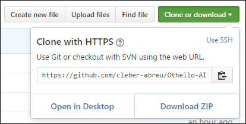
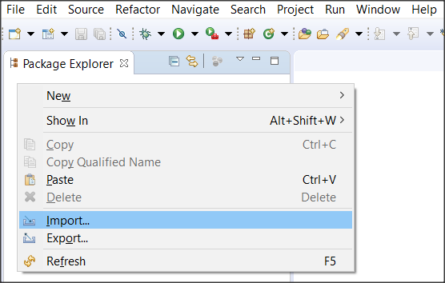
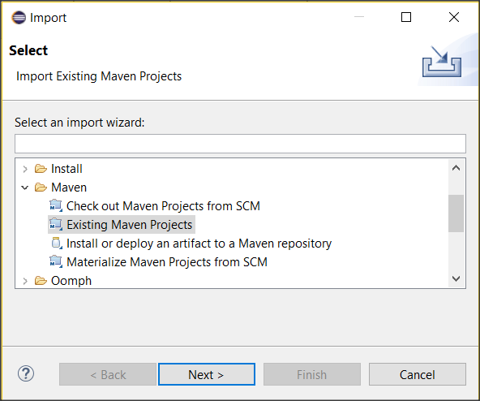
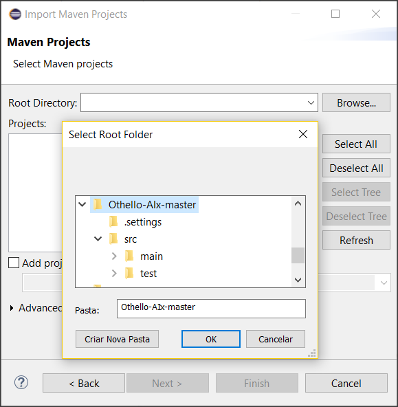
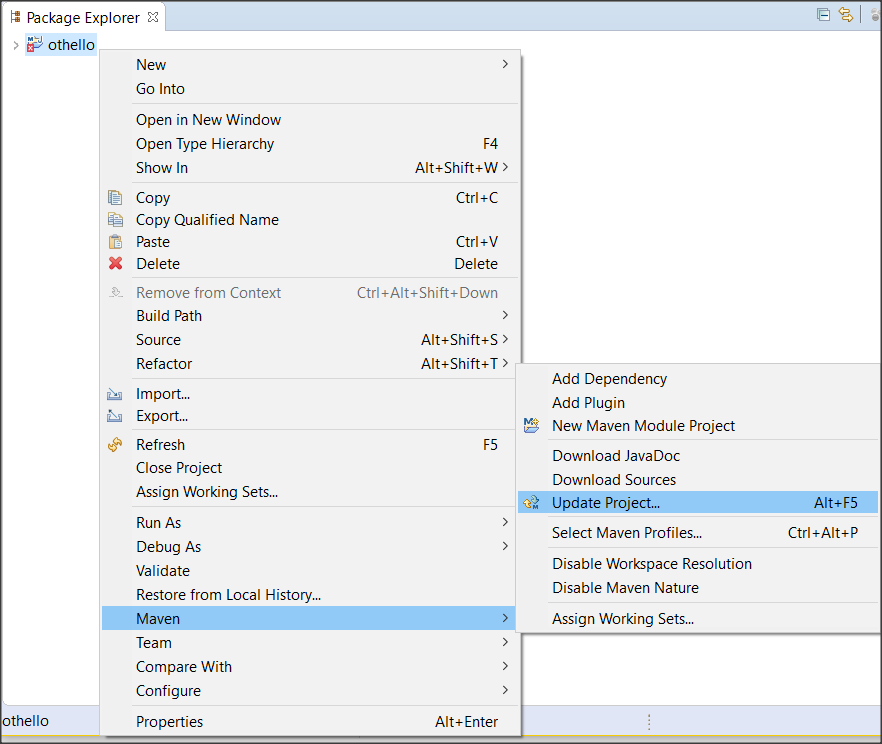
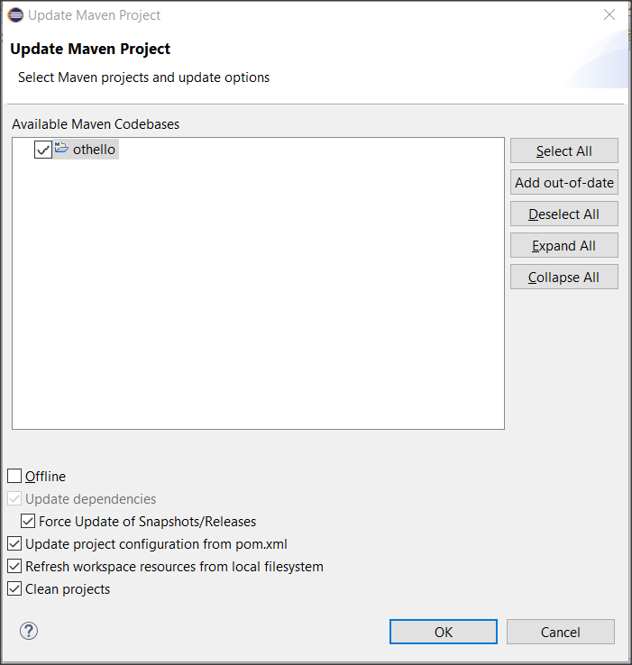

# Othello-AIx
========
### Como Começar
##### Clone o repositório ou faça o download da branch master 

 *(lembre-se do diretório destino e de tirar do zip caso tenha escolhido download .zip)*
##### A partir do Eclipse(Java SE) navegue: File>Import 

##### Escolha importar um Projeto Maven Exisente 

##### Selecione o diretorio baixado 

##### Caso Aconteça algum problema ao importar aquivo, faça o update do projeto 

##### Marque force update e dê ok 

